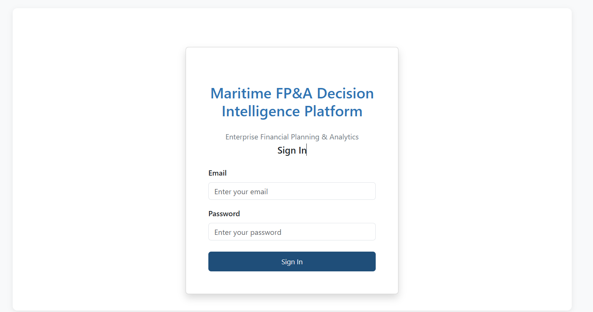
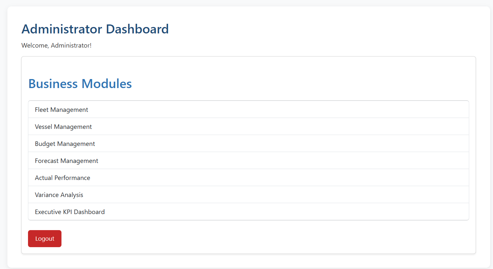
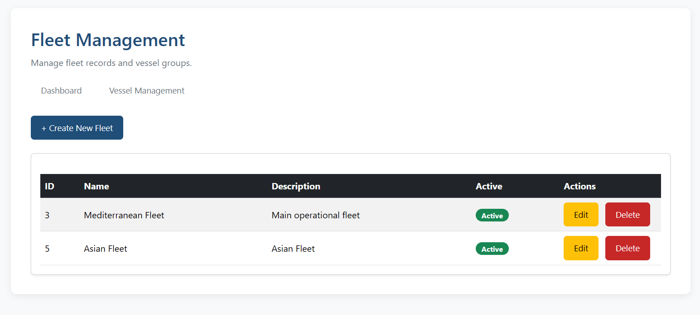
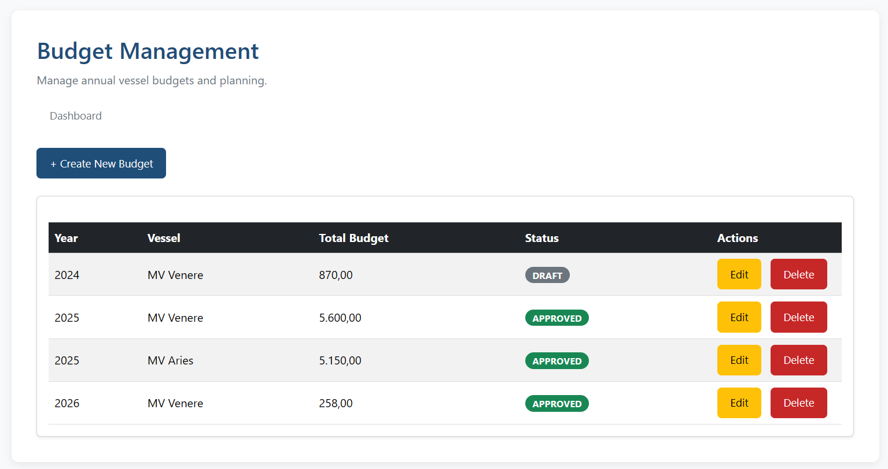
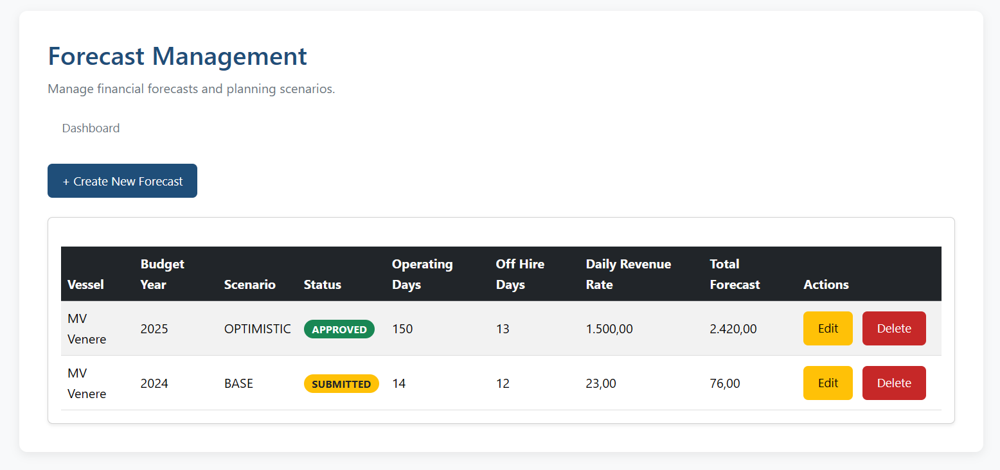
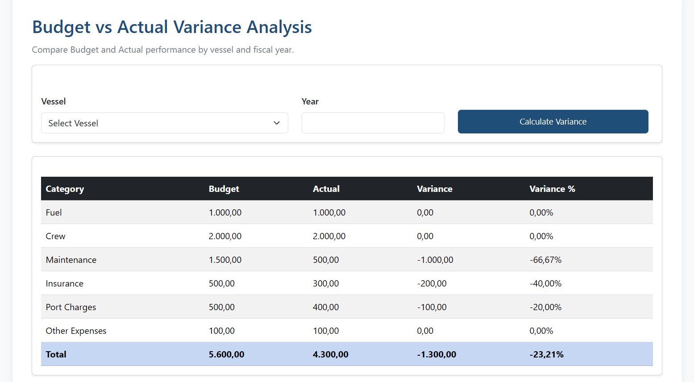
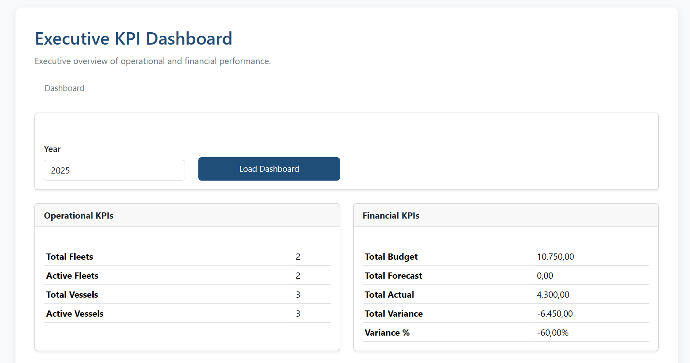

# 🚢 Maritime FP&A Decision Intelligence Platform

### Enterprise Financial Planning & Analysis Platform for Maritime Fleet Management

A full-stack enterprise web application developed with **Spring Boot MVC** and **Thymeleaf** that enables shipping organizations to manage fleets, budgets, forecasts, actual performance, financial variance analysis, and executive KPIs through a secure role-based environment.

> **Final Project – Coding Factory 10**  
> Athens University of Economics and Business (AUEB)
> 
> 


> 
> ## Highlights

- Enterprise Spring Boot MVC Application
- Maritime Financial Planning & Analysis Platform
- Secure Role-Based Access Control (RBAC)
- Six End-to-End Business Capabilities
- PostgreSQL Persistence with Spring Data JPA
- Professional GitHub Portfolio Project

## Executive Summary

The **Maritime FP&A Decision Intelligence Platform** is an enterprise-oriented Financial Planning & Analysis (FP&A) web application designed for the maritime industry.

The platform digitalizes key financial planning processes by integrating fleet management, budgeting, forecasting, actual performance monitoring, financial variance analysis, and executive KPI reporting into a single secure application.

Developed using the **Spring Boot MVC architecture**, the application follows enterprise software engineering principles through a layered design consisting of **Controllers**, **Services**, and **Repositories**, while using **Thymeleaf Server-Side Rendering (SSR)** for the presentation layer.

The platform implements **Role-Based Access Control (RBAC)** with three user roles (**Administrator**, **Manager**, and **Analyst**) to ensure secure access to business functionality according to organizational responsibilities.

This project was developed as the **final project of Coding Factory 10 (Athens University of Economics and Business)** and serves both as an academic capstone and as a professional portfolio project demonstrating modern Java enterprise application development practices.

## Business Problem

Modern shipping companies operate in an increasingly complex business environment, where financial planning requires the integration of operational data, budgeting, forecasting, performance monitoring, and executive reporting.

Many organizations still rely on disconnected spreadsheets and manual processes to manage financial planning activities. This often results in:

- Limited visibility into fleet financial performance
- Time-consuming budget preparation and maintenance
- Difficult comparison between planned and actual results
- Delayed management reporting
- Inconsistent decision-making across business units

As fleet size and operational complexity increase, these challenges make it difficult for finance teams and management to produce timely, reliable, and data-driven decisions.

The **Maritime FP&A Decision Intelligence Platform** addresses these challenges by centralizing key Financial Planning & Analysis (FP&A) processes into a secure enterprise web application. It combines fleet management, financial planning, variance analysis, and executive KPI reporting within a unified system designed to support operational and strategic decision-making.

## Key Features

| Feature | Description |
|----------|-------------|
| 🔐 **Authentication & Authorization** | Secure user authentication and Role-Based Access Control (RBAC) with Administrator, Manager, and Analyst roles. |
| 🚢 **Fleet & Vessel Management** | Centralized management of fleets and vessels with relational data modeling and operational information. |
| 💰 **Budget Planning** | Annual budget creation, maintenance, and financial planning for individual vessels. |
| 📈 **Forecast & Scenario Planning** | Financial forecasting with Base, Best Case, and Worst Case scenarios to support planning decisions. |
| 📊 **Actual Performance & Variance Analysis** | Comparison of Budget versus Actual performance with automated variance calculations and financial insights. |
| 📉 **Executive KPI Dashboard** | Consolidated financial KPIs and performance indicators to support executive decision-making. |
| 🏗️ **Enterprise Architecture** | Layered Spring MVC architecture following Controller–Service–Repository design principles. |
| 🗄️ **Data Persistence** | PostgreSQL database integration using Spring Data JPA and Hibernate ORM. |
| 🖥️ **Modern Web Interface** | Responsive server-side rendered UI built with Thymeleaf and Bootstrap 5. |

> **Application at a Glance**
>
> - 6 Business Capabilities
> - 3 User Roles
> - 9 Core Domain Entities
> - Spring MVC Layered Architecture
> - PostgreSQL Relational Database
> - Secure Authentication & Authorization
> 
> ## Business Capabilities

The platform is organized into six core Business Capabilities (BCs), each representing a major functional area of the Financial Planning & Analysis (FP&A) process.

| Business Capability | Description |
|---------------------|-------------|
| **BC-01 – Authentication & Authorization** | Secure user authentication and Role-Based Access Control (RBAC) using Spring Security with Administrator, Manager, and Analyst roles. |
| **BC-02 – Fleet Management** | Management of fleets and vessels, including vessel registration, fleet assignment, operational data, and lifecycle administration. |
| **BC-03 – Budget Management** | Annual vessel budget planning with financial data management and automated total budget calculations. |
| **BC-04 – Forecast & Scenario Planning** | Creation of financial forecasts using multiple planning scenarios (Base, Best Case, and Worst Case) for decision support. |
| **BC-05 – Actual Performance & Variance Analysis** | Recording of actual financial performance and automated Budget vs Actual variance analysis to evaluate operational results. |
| **BC-06 – KPI Analytics & Executive Dashboard** | Executive dashboards providing financial KPIs and performance indicators for management reporting and strategic decision-making. |

```text
                    Maritime FP&A Platform

      ┌───────────────────────────────────────────┐
      │ BC-01 Authentication & Authorization      │
      └───────────────────────────────────────────┘
                        │
                        ▼
      ┌───────────────────────────────────────────┐
      │ BC-02 Fleet Management                    │
      └───────────────────────────────────────────┘
                        │
                        ▼
      ┌───────────────────────────────────────────┐
      │ BC-03 Budget Management                   │
      └───────────────────────────────────────────┘
                        │
                        ▼
      ┌───────────────────────────────────────────┐
      │ BC-04 Forecast & Scenario Planning        │
      └───────────────────────────────────────────┘
                        │
                        ▼
      ┌───────────────────────────────────────────┐
      │ BC-05 Actual Performance & Variance       │
      └───────────────────────────────────────────┘
                        │
                        ▼
      ┌───────────────────────────────────────────┐
      │ BC-06 KPI Analytics & Executive Dashboard │
      └───────────────────────────────────────────┘
```


## Architecture

The application follows a layered Spring MVC architecture based on the Separation of Concerns (SoC) principle.

```text
User
   │
   ▼
Thymeleaf Views
   │
   ▼
Spring MVC Controllers
   │
   ▼
Business Services
   │
   ▼
Spring Data JPA Repositories
   │
   ▼
PostgreSQL Database
```

The application follows the Controller–Service–Repository pattern, ensuring a clear separation between presentation, business logic, and data access layers. Spring Security provides authentication and role-based authorization, while Thymeleaf is used for server-side rendering of the user interface.

## Technology Stack

| Category | Technology |
|----------|------------|
| **Programming Language** | Java 17 |
| **Framework** | Spring Boot 3 |
| **Architecture** | Spring MVC |
| **Presentation Layer** | Thymeleaf |
| **Security** | Spring Security |
| **Persistence** | Spring Data JPA, Hibernate |
| **Database** | PostgreSQL |
| **Build Tool** | Maven |
| **Frontend** | HTML5, CSS3, Bootstrap 5 |
| **Template Engine** | Thymeleaf |
| **IDE** | IntelliJ IDEA Community Edition |
| **Version Control** | Git & GitHub |

### Architectural Choices

| Decision | Implementation |
|----------|----------------|
| **Application Type** | Server-Side Rendered (SSR) Web Application |
| **Architecture Pattern** | Layered Spring MVC |
| **Authentication** | Form-Based Authentication |
| **Authorization** | Role-Based Access Control (RBAC) |
| **ORM** | Hibernate (Spring Data JPA) |
| **Database Design** | Relational Database |
| **UI Framework** | Bootstrap 5 |

## Domain Model

The application is built around a domain model representing the core financial planning and operational processes of a maritime organization.

The primary business entities include:

- **User** – Application users with role-based access.
- **Role** – Defines authorization levels (Administrator, Manager, Analyst).
- **Fleet** – Represents a collection of vessels.
- **Vessel** – Stores operational and technical information for each vessel.
- **Budget** – Annual financial planning data for each vessel.
- **Forecast** – Scenario-based financial projections (Base, Best Case, Worst Case).
- **Actual** – Actual financial performance used for variance analysis.

These entities are mapped to a PostgreSQL relational database using Spring Data JPA and Hibernate, forming the foundation of the platform's Financial Planning & Analysis (FP&A) processes.

## Technology Stack

| Category | Technology |
|----------|------------|
| **Programming Language** | Java 17 |
| **Framework** | Spring Boot 3 |
| **Architecture** | Spring MVC |
| **Presentation Layer** | Thymeleaf |
| **Security** | Spring Security |
| **Persistence** | Spring Data JPA, Hibernate ORM |
| **Database** | PostgreSQL |
| **Frontend** | HTML5, CSS3, Bootstrap 5 |
| **Build Tool** | Maven |
| **Version Control** | Git & GitHub |
| **Development Environment** | IntelliJ IDEA Community Edition |
| **Database** | PostgreSQL |

The application was developed using modern Java enterprise technologies, following Spring Boot best practices and a layered MVC architecture. The selected technology stack provides a secure, maintainable, and scalable foundation for Financial Planning & Analysis (FP&A) processes within the maritime domain.

## Project Structure & Package Organization

```text
maritime-fpa-platform
│
├── src
│   ├── main
│   │   ├── java
│   │   │   └── com.afroditigkotsi.maritimefpaplatform
│   │   │       ├── config
│   │   │       ├── controller
│   │   │       ├── entity
│   │   │       ├── enums
│   │   │       ├── repository
│   │   │       ├── security
│   │   │       ├── service
│   │   │       └── MaritimeFpaPlatformApplication.java
│   │   │
│   │   └── resources
│   │       ├── static
│   │       │   └── css
│   │       ├── templates
│   │       └── application.properties
│   │
│   └── test
│
├── pom.xml
└── README.md
```

## Application Screenshots

### Login



---

### Administrator Dashboard



---

### Fleet Management



---

### Budget Management



---

### Forecast & Scenario Planning



---

### Actual Performance & Variance Analysis



---

### Executive KPI Dashboard



### Package Overview

| Package | Responsibility |
|---------|----------------|
| **config** | Spring Boot configuration classes |
| **controller** | Handles HTTP requests and application flow |
| **entity** | JPA domain entities |
| **enums** | Business enumerations |
| **repository** | Spring Data JPA repositories |
| **security** | Spring Security configuration and authentication |
| **service** | Business logic and application services |
| **templates** | Thymeleaf views |
| **static** | CSS and static web resources |

## Installation

### Prerequisites

Before running the application, ensure the following software is installed:

| Software | Version |
|----------|---------|
| Java | 17 or later |
| Maven | 3.9+ |
| PostgreSQL | 17 (or compatible) |
| Git | Latest |
| IntelliJ IDEA | Community or Ultimate Edition (recommended) |

---

### Clone the Repository

```bash
git clone https://github.com/<your-username>/maritime-fpa-platform.git
cd maritime-fpa-platform
```

---

### Configure the Database

Create a PostgreSQL database:

```sql
CREATE DATABASE maritime_fpa_db;
```

Update the database configuration in:

```text
src/main/resources/application.properties
```

Example:

```properties
spring.datasource.url=jdbc:postgresql://localhost:5432/maritime_fpa_db
spring.datasource.username=your_username
spring.datasource.password=your_password

spring.jpa.hibernate.ddl-auto=update
```

> **Note**
>
> The application automatically creates or updates the database schema on startup using Hibernate (`spring.jpa.hibernate.ddl-auto=update`).
> 
> ## Build & Deployment

### Build the Application

Use Maven to compile and package the project:

```bash
mvn clean install
```

The generated executable JAR file will be located in:

```text
target/
```

---

### Run the Application

Start the application using Maven:

```bash
mvn spring-boot:run
```

Alternatively, run the packaged JAR:

```bash
java -jar target/maritime-fpa-platform-0.0.1-SNAPSHOT.jar
```

---

### Access the Application

Once the application is running, open your browser and navigate to:

```text
http://localhost:8080
```

The application will display the login page, where users can authenticate according to their assigned role (Administrator, Manager, or Analyst).

---

### Database Initialization

The application uses Hibernate for schema management.

On startup, Hibernate automatically creates or updates the database schema based on the configured JPA entities:

```properties
spring.jpa.hibernate.ddl-auto=update
```

No manual SQL scripts are required for the initial database schema creation.

Note: This project is currently intended for local deployment and development environments.

## Project Status

**Current Version:** v1.0

The application has reached its first stable release and includes the complete implementation of all planned Business Capabilities:

- ✅ BC-01 Authentication & Authorization
- ✅ BC-02 Fleet Management
- ✅ BC-03 Budget Management
- ✅ BC-04 Forecast & Scenario Planning
- ✅ BC-05 Actual Performance & Variance Analysis
- ✅ BC-06 KPI Analytics & Executive Dashboard

The project is fully functional and serves as both the final Coding Factory project and a professional portfolio application.

## Future Roadmap

Planned enhancements for future releases include:

- ESG Performance Analytics
- Carbon Emissions Management
- AI-assisted Forecasting
- What-if Scenario Simulation
- Interactive Financial Dashboards
- Docker containerization
- CI/CD pipeline integration
- Cloud deployment
- REST API for third-party integrations


